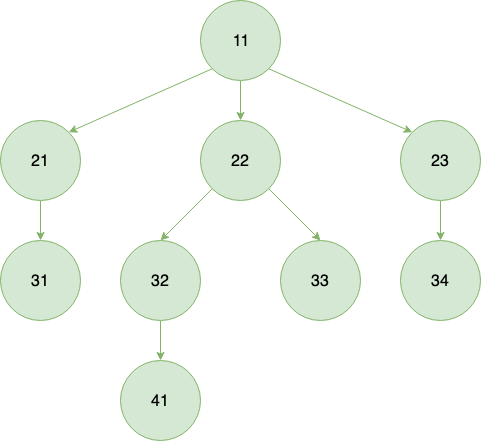
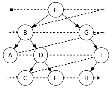

# 深度优先 vs 广度优先

## 树
* 深度：根的深度为0
* 高度：树叶的高度为0

## Breadth First Search vs Depth First Search:

## Normal tree traversal:
  

## Binary tree BFS traversal:
  

## Binary tree DFS traversal:
  
  
  

