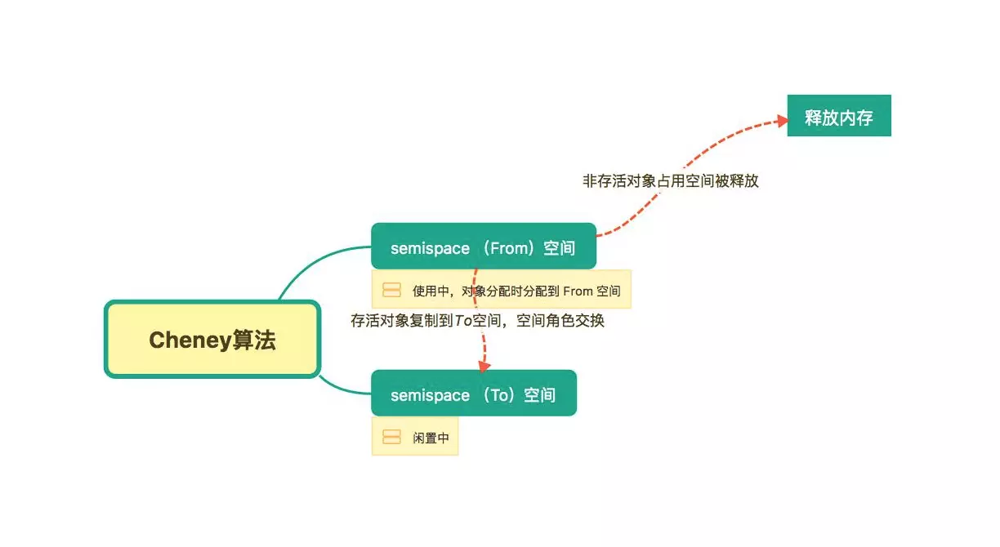
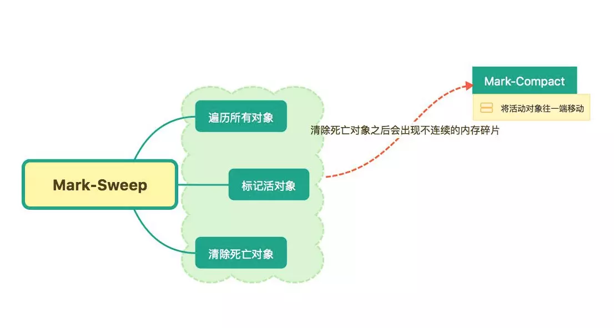

# 垃圾回收

## 引用计数 Reference-counting
对象每次被引用，计数器加一，垃圾回收时会清除计数器为零的对象
缺陷：当两个对象出现循环引用的时候会导致内存泄漏

## V8 GC

64位系统，新生代默认内存 32MB，老生代默认内存 1400MB，保留空间为 1464MB

#### 新生代
垃圾回收特别频繁，大多数对象分配在新生代

Scavenge 算法进行垃圾回收：新生代内存分为两块，对象在 From 空间进行分配，垃圾回收时检查 From 空间的存活对象，复制到 To 空间，释放非存活对象，两块空间角色对换

#### 老生代
老生代是生存周期很长，占用内存也较多的对象

新生代的对象经过多次清理依旧存在，则会移到老生代
如果对象从 From 空间复制到 To 空间时，To 空间被使用了 25%，则对象会被移到到老生代

#### 标记清除 Mark-Sweep
标记阶段：从根节点遍历所有对象，标记所有根节点可到达的对象
清除阶段：清除没有被标记的对象

#### 标记整理 Mark-Compact
标记清除后内存空间不连续，导致出现很多内存碎片，导致后续分配内存占用较多的大对象时，内存碎片不够用，为了解决内存碎片的问题，使用标记整理

深度优先遍历，白、灰、黑三色标记

1. 所有对象标记为白色
2. 根节点的直接引用对象，

