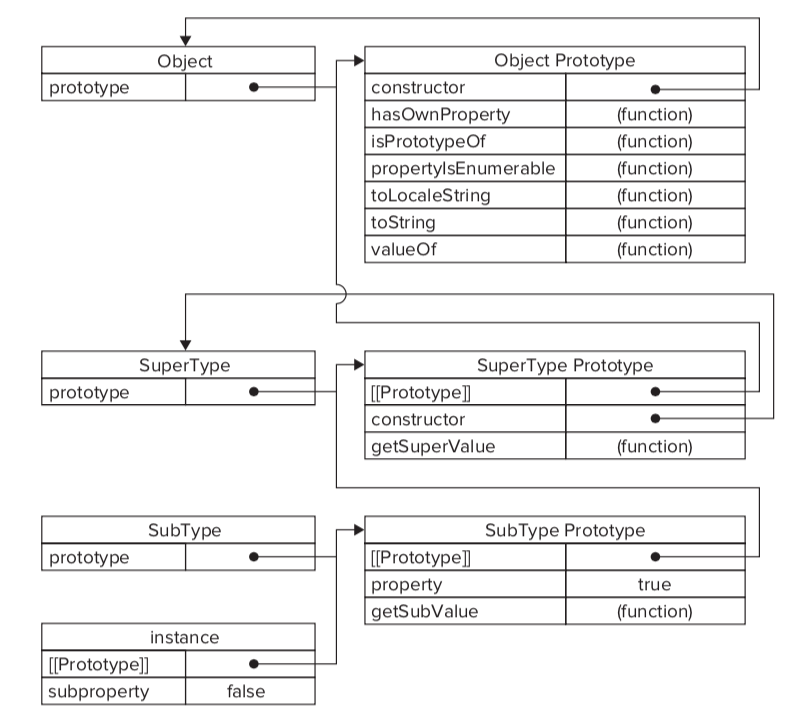

# 原型链

## Function
所有function的默认原型是Object的一个实例
```javascript
function F(){}

Object.prototype.isPrototypeOf(F.prototype)  // true
Object.prototype === {}.__proto__            // true
Object.prototype === F.prototype.__proto__   // true
```

## [[Prototype]]
对象内部的[[Prototype]]值，是一个可访问属性（getter & setter 方法）, ES6 里面等价于 Object.getPrototypeOf & Object.setPrototypeOf

对象字面量的[[Prototype]]值为 Object.prototype

数组字面量的[[Prototype]]值为 Array.prototype

函数的[[Prototype]]值为 Function.prototype

使用new运算符调用 Array,Boolean,Date,Number,Object,String 创建的对象的[[Prototype]]值为对应构造函数的 prototype

使用new运算符调用自定义的函数时，创建的对象的[[Prototype]]值为构造函数的prototype值

prototype：是函数的一个属性，用来在 new 运算符调用时，创建 [[Prototype]]
[[Prototype]]：是原型链寻找对应属性时实际用到的对象


Object.prototype的[[Prototype]]为 null

## new 运算符

执行`new Foo()` 会进行下面的过程：
1. 创建一个继承自 `Foo.prototype` 的新对象
2. 将 `this` 绑定到新的对象上并调用构造函数 `Foo`，`new Foo` 等同于 `new Foo()`
3. 如果构造函数没有显示返回一个对象，则使用步骤1创建的对象

如果构造函数返回的是原始类型（Boolean, Null, Undefined, Number, String, Symbol），返回值仍是步骤1创建的对象

如果构造函数返回的是一个对象，则返回值就是该对象

## 原型链继承

1. Prototype Chaining



```javascript
function SuperType(){
    this.property = true;
}

SuperType.prototype.getSuperValue = function(){
    return this.property;
}

function SubType(){
    this.subproperty = false;
}

SubType.prototype = new SuperType();

SubType.prototype.getSubValue = function(){
    return this.subproperty;
}

var instance = new SubType();
console.log(instance.getSuperValue()); // true
```

存在的问题：

* 由于创建了一个新的SuperType实例，SubType的实例会共享SuperType构造函数声明的引用值
* 无法向SuperType的构造函数传递参数

```javascript
function SuperType(){
    this.colors = ["red", "blue", "green"];
}

...

var instance1 = new SubType();
instance1.colors.push("black");

var instance2 = new SubType();

console.log(instance1.colors);  // "red", "blue", "green", "black"
console.log(instance2.colors);  // "red", "blue", "green", "black"  
```

2. Combination Inheritance

为了解决Prototype Chaining的问题，引入Constructor Stealing的方式

```javascript
function SuperType(name){
    this.name = name;
    this.colors = ["red", "blue", "green"];
}

SuperType.prototype.sayName = function(){
    console.log(this.name);
}

function SubType(name, age){
    // inherit properties
    SuperType.call(this, name);         // second call to SuperType()

    // instance property
    this.age = age;
}

SubType.prototype = new SuperType();    // first call to SuperType()
SubType.prototype.constructor = SubType;

SubType.prototype.sayAge = function(){
    console.info(this.age);
}

var instance1 = new SubType("s1", 18);
instance1.colors.push("black");
console.log(instance1.colors);  // "red", "blue", "green", "black"
instance1.sayName();            // "s1"
instance1.sayAge();             //  18

var instance2 = new SubType("s2", 20);
console.log(instance2.colors);  // "red", "blue", "green"
instance2.sayName();            // "s2"
instance2.sayAge();             //  20
```

存在的问题：

* SuperType的构造函数被调用了两次，属性产生了冗余

3. Parasitic Combination Inheritance

```javascript
function _extends(subClass, superClass){
    function F(){};
    F.prototype = superClass.prototype;
    subClass.prototype = new F();
    subClass.prototype.constructor = subClass;
}

function SuperType(name){
    this.name = name;
    this.colors = ["red", "blue", "green"];
}

SuperType.prototype.sayName = function(){
    console.log(this.name);
}

function SubType(name, age){
    SuperType.call(this, name);

    this.age = age;
}

_extends(SubType, SuperType);

SubType.prototype.sayAge = function(){
    console.log(this.age);
}

var instance1 = new SubType("s1", 18);
instance1.colors.push("black");
console.log(instance1.colors);  // "red", "blue", "green", "black"
instance1.sayName();            // "s1"
instance1.sayAge();             //  18

var instance2 = new SubType("s2", 20);
console.log(instance2.colors);  // "red", "blue", "green"
instance2.sayName();            // "s2"
instance2.sayAge();             //  20

```

4. ES6 extend 实现

```javascript
function _createObject(proto){
    function F(){}
    F.prototype = proto
    return new F()
}

function _inheritPrototype(subClass, superClass){
    subClass.prototype = _createObject(superClass.prototype)
    subClass.prototype.constructor = subClass
    Object.setPrototypeOf(subClass, superClass)
}

function SuperType(name) {
    this.name = name
    this.colors = ["red", "blue", "green"]
}

SuperType.prototype.sayName = function(){
    console.log(this.name)
}

function SubType(name, age) {
    Object.getPrototypeOf(SubType).call(this, name)

    this.age = age
}

_inheritPrototype(SubType, SuperType)

SubType.prototype.sayAge = function(){
    console.log(this.age)
}

let instance1 = new SubType("s1", 18);
instance1.colors.push("black");
console.log(instance1.colors);  // "red", "blue", "green", "black"
instance1.sayName();            // "s1"
instance1.sayAge();             //  18

Object.getPrototypeOf(Object.getPrototypeOf(instance1).constructor.prototype).constructor === SuperType // true
```