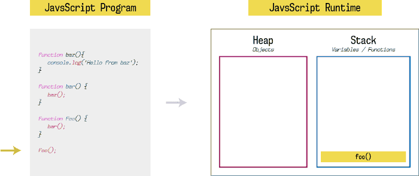
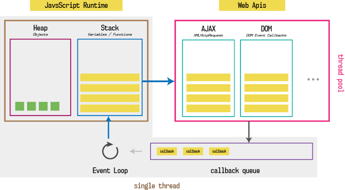

# 运行时

JavaScript 的并发模型基于 event loop


## Stack

函数调用形成栈

函数调用栈遵循 LIFO (Last In First Out)

Call Stack：记录函数执行完成时应该交还控制权的位置
* 调用 function 时，加入调用栈并开始执行
* 正在调用栈执行的函数调用其它函数时，新函数也被加入调用栈，并开始执行
* 当前函数执行完毕，解释器将其清出调用栈，继续执行当前执行环境剩下的代码
* 当分配的调用栈空间被占满，会触发堆栈溢出

```javascript
function baz() {
    console.log('Hello from baz')
}
function bar() {
    baz()
}
function foo() {
    bar()
}
foo()
```

函数的执行顺序如下：
1. 开始执行`foo()`的调用
2. 把`foo()`加入调用栈
```
Call stack list:
- foo
```
3. 执行`foo()`内部的代码
4. 开始执行`bar()`的调用
5. 把`bar()`加入调用栈
```
Call stack list:
- foo
- bar
```
6. 执行`bar()`内部的代码
7. 开始执行`baz()`的调用
8. 把`baz()`加入调用栈
```
Call stack list:
- foo
- bar
- baz
```
9. 把`console.log('Hello from baz')`加入调用栈
```
Call stack list:
- foo
- bar
- baz
- console.log('Hello from baz')
```
10. 当`console.log('Hello from baz')`执行完毕，清出调用栈
```
Call stack list:
- foo
- bar
- baz
```
11. 当`baz()`执行完毕，返回`baz()`被调用的位置，清出调用栈
```
Call stack list:
- foo
- bar
```
12. 继续执行`bar()`剩余的代码
13. 当`bar()`执行完毕，返回`bar()`被调用的位置，清出调用栈
```
Call stack list:
- foo
```
14. 继续执行`foo()`剩余的代码
15. 当`foo()`执行完毕，清出调用栈
```
Call stack list:
EMPTY
```



## Heap

对象分配在堆中

## Queue

JavaScript运行时使用了一个消息队列，队列中的每一条消息都关联了处理函数

运行时从最先进入队列的消息开始处理队列中的消息，这条消息被移出队列并作为输入参数调用关联函数，创造一个新的栈

## Event Loop

```javascript
while (queue.waitForMessage()) {
  queue.processNextMessage();
}
```

每一条消息完整执行后，后续消息才会被执行，所以一个函数被执行时，它永远不会被抢占，并且在其它代码运行之前完整执行

缺点：如果一个消息的执行时间过长，web应用就无法处理用户的交互行为，所以应该缩短消息的处理耗时

setTimeout 添加的消息并不会精确的在延迟时间后立即执行，它必须等待前置消息处理完成

```javascript
const s = new Date().getSeconds();

setTimeout(function() {
  // 输出 "2"，表示回调函数并没有在 500 毫秒之后立即执行
  console.log("Ran after " + (new Date().getSeconds() - s) + " seconds");
}, 500);

while(true) {
  if(new Date().getSeconds() - s >= 2) {
    console.log("Good, looped for 2 seconds");
    break;
  }
}
```



JavaScript 的 runtime 包含 **event loop** 和 **callback queue(message queue)**，浏览器把 HTTP请求、DOM事件、setTimeout、setInterval等特性封装成 JavaScript API，也被称为 **Web APIs**，这些 **Web APIs** 都是异步的


```javascript
function printHello() {
    console.log('Hello from baz');
}
function baz() {
    // 1. 加入调用栈，
    // 2. 由于setTimeout的控制权就移交给Web APIs，当执行完毕后，回调函数放到 callback queue，等待 event loop 下次调度
    // 3. 清出调用栈
    // 4. 继续执行后续代码
    // 5. 整个函数执行完成，call stack 清空后，event loop 检查 callback queue，把 callback 放回 call stack 进行执行
    setTimeout(printHello, 3000);
    console.log("baz")
}
function bar() {
    baz();
    console.log("bar")
}
function foo() {
    bar();
    console.log("foo")
}
foo();
```

## Microtasks & Macrotasks

```javascript
console.log('script start');

setTimeout(function() {
  console.log('setTimeout');
}, 0);

Promise.resolve().then(function() {
  console.log('promise1');
}).then(function() {
  console.log('promise2');
});

console.log('script end');
```

输出结果：`script start,script end,promise1,promise2,setTimeout`

```html
<div class="outer">
  <div class="inner"></div>
</div>
```

```javascript
// Let's get hold of those elements
var outer = document.querySelector('.outer');
var inner = document.querySelector('.inner');

// Let's listen for attribute changes on the
// outer element
new MutationObserver(function() {
  console.log('mutate');
}).observe(outer, {
  attributes: true
});

// Here's a click listener…
function onClick() {
  console.log('click');

  setTimeout(function() {
    console.log('timeout');
  }, 0);

  Promise.resolve().then(function() {
    console.log('promise');
  });

  outer.setAttribute('data-random', Math.random());
}

// …which we'll attach to both elements
inner.addEventListener('click', onClick);
outer.addEventListener('click', onClick);
```

如果在浏览器点击 `inner` 标签，输出结果：`click,promise,mutate,click,promise,mutate,timeout,timeout`，inner 的回调完成后，会检查 microtask 并执行，然后再执行 outer 的回调

如果在 JavaScript 代码中执行 `inner.click()`，输出结果：`click,click,promise,mutate,promise,timeout,timeout`，由于 JavaScript 中触发的 click 事件会在当前 call stack 同步分发给inner、outer 的回调，所以等待所有的 JavaScript 代码执行完成后，才会再检查 microtask 并执行

#### Microtasks

  promise calbacks、mutation observer callbacks 的回调在 microtask queue 中被调度

  1. 当前 call stack 为空时，会开始执行 microtasks
  
  2. 每次回调后，且没有正在执行中的 JavaScript 代码时，会开始执行 microtasks