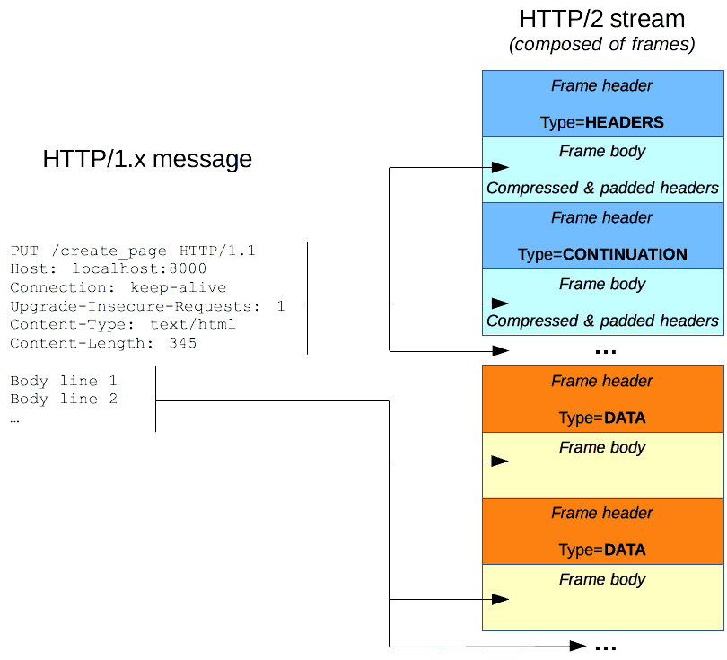

# HTTP

HTTP 是 Web 浏览器和 Web 服务器间通信的协议，是一种 client-server 协议

四层网络模型
应用层：HTTP、DNS、SMTP
传输层：TCP、UDP
网络层：IP、ICMP
数据链路层：ARP，RARP

## 流程
1. 打开一个新的 TCP 链接
2. 发送一个 HTTP 报文
3. 读取服务端返回的报文
4. 关闭链接（当或为后续请求重用链接）

## HTTP 报文

Request：
* 一个 HTTP 的 Method
* 资源路径
* HTTP 协议版本号
* 提供给服务端的可选头部信息
* 请求消息体

Response：
* HTTP 协议版本号
* 状态码
* 状态信息
* 头部信息
* 响应消息体

## TCP/IP

初始链接三次握手
1. 两端 TCP 进程都处于 CLOSE 状态
2. 客户端主动打开链接，服务端被动打开链接
3. 服务端打开链接后处于 LISTEN 状态，等待客户端请求
4. 客户端向服务端发送请求报文，SYN=1，ACK=0，选择初始序号 seq=x
5. 服务端收到请求报文，向客户端发送确认报文，SYN=1，ACK=1，确认号 ack=x+1，同时选择初始序号 seq=y
6. 客户端收到服务端确认报文后，再向服务端发出确认，ACK=1，确认号 ack=y+1y+1，序号 seq=x+1s

关闭链接四次挥手
1. 客户端发送释放报文，FIN=1
2. 服务端收到报文后发出确认，ACK=1，此时 TCP 处于半关闭状态，服务端可以向客户端发送数据，但客户端不能向服务端发送数据
3. 服务端发送完毕还未传送的数据后，发送释放报文，FIN=1
4. 客户端收到服务端确认报文后，再次发送确认报文，ACK=1，等待 2 MSL（最大报文存活时间）后释放链接
5. 服务端收到客户端的确认报文后，释放链接

## HTTPS

HTTP over TLS，HTTPS 运行在 TLS 之上，TLS 运行在 TCP 上，所有传输的内容都是经过加密的

HTTP 缺点：
* 通信使用明文，内容容易被窃听
* 通信内容容易被修改
* 通信方的身份无法验证，可能被伪装

流程
1. 建立 TCP 链接
2. 客户端发起 clientHello 消息，包含客户端生成的随机数字、支持的加密算法，支持的协议版本
3. 服务器收到 clientHello 消息后，从客户端支持的加密算法中选择一个，生成一个随机数，发送给客户端 serverHello 消息，包含服务端 TLS 版本、服务端选择的加密和压缩算法、数字证书认证机构（CA）签发的服务器公开证书（证书中包含公钥）
4. 客户端根据自己的信任 CA 列表，验证服务端的证书，取出服务端的公钥，再生成一个随机数，使用公钥非对称加密后生成 PreMaster Key 发送给服务端
5. 服务端接收到后，通过私钥解密 PreMaster Key，获取随机数，并生成 Session Secret，发送给客户端，告知客户端准备使用 Session Secret 加密数据，之后服务端使用 Session Secret 加密一段 Finish 消息发送给客户端，验证加密通道是否成功
6. 接下来客户端和服务端就使用 Session Secret 对数据进行加密传输

使用 HSTS 策略让浏览器强制使用 HTTPS，避免重定向带来的额外请求和劫持风险， 请求头添加 Strict-Transport-Security

## HTTP/2

HTTP/1.x 缺点：
* Header 不会被压缩
* 多个报文中的 Header 非常相似，会在链接中重复传输
* 链接无法复用，需要在同一个服务器上打开多个链接

HTTP/2 引入了一个额外步骤：将 HTTP/1.x 消息分成帧嵌入到 stream 中，Data 和 Header 帧分离，这样 Header 就能进行压缩

HTTP/2 帧机制是在 HTTP/1.x 的基础上新增了一个中间层，主要特性
* 二进制分帧
* 头部压缩
* 多路复用
* 服务端推送

## TCP UDP

### TCP
TCP 是面向链接、可靠的流协议，实行顺序控制和重发控制机制，还具备流量控制、拥塞控制、提高网络利用率等功能，TCP 应用在有可靠性要求的场景

由滑动窗口协议实现流量控制，控制发送者的速度，保证分组无差错、有序的被接收

由拥塞控制协议控制网络负载，慢开始、快重传

### UDP
UDP 是面向无链接、不可靠的数据报协议，UDP 应用在对高速传输和实时性有要求的通信、广播场景

UDP 可靠性：QUIC