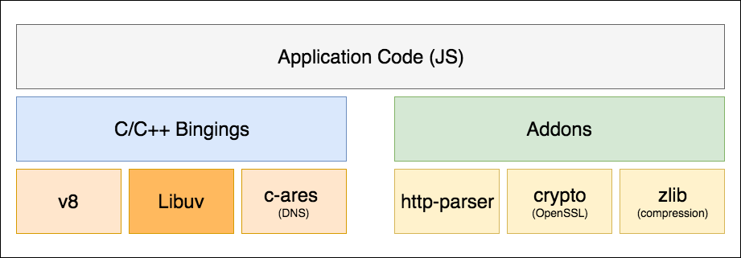
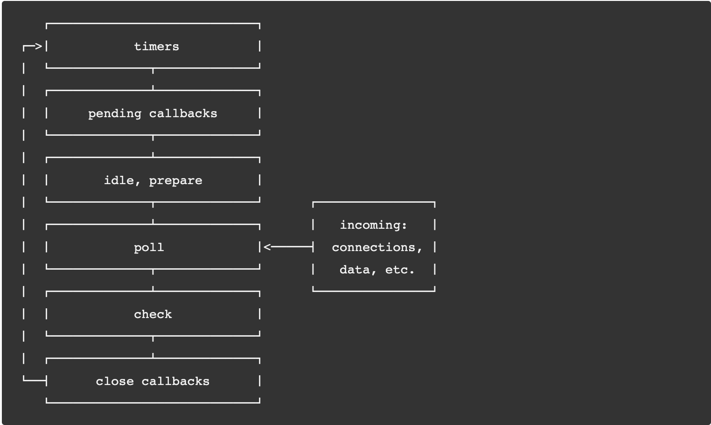

# Node.js 知识点

定义：在 V8 引擎之上构建的 JavaScript 运行环境

**version: 10.16.0 LTS**

v12 更新（性能提升明显）：V8 引擎更新，TLS 更新，http 解析器更新为 llhttp

- [x] Blocking vs Non-Blocking

    I/O：主要指由 libuv 支持的，与系统磁盘和网络进行的交互

    Blocking（阻塞）：阻塞方法是同步执行，Node.js 进程必须等待一个非 JavaScript 的操作完成，才能执行剩余的 JavaScript 代码

    Non-Blocking（非阻塞）：非阻塞方法是异步，Node.js 进程无需等待 I/O 完成，可以继续执行后续的代码，当 I/O 完成时触发回调函数

- [x] Event Loop

    定义：允许 Node.js 执行非阻塞 I/O 操作的手段

    event loop 按照执行顺序分为六个阶段

1. timers：执行 `setTimeout()`和`setInterval()`的回调，timers 的执行时间会受到 poll 阶段的影响
2. pending callbacks：上个 event loop 延迟到这个 loop 的 I/O 回调，一般是系统操作的回调，例如 监听 TCP ECONNREFUSED 错误的回调
3. idle：内部使用
4. poll：检索新的 I/O 事件，执行 I/O 回调，等待 I/O 回调执行完成，所以这里会产生阻塞
    * 当执行到 poll 阶段，且当前没有需要调度的 `timers`
        * 当 poll 阶段的 callback queue 不为空时，遍历 callback queue 并同步执行
        * 当 poll 阶段的 callback queue 为空时
            * 如果存在 `setImmediate()` 的调度，则开始 check 阶段
            * 如果不存在 `setImmediate()` 的调度，则等待 I/O 回调加入到 callback queue，然后立即执行
    * 当执行到 poll 阶段，且 `timers` 内的回调已经准备好被调度，则 event loop 跳回 `timers` 阶段去执行回调
5. check：`setImmediate()`的回调
6. close callbacks：close 事件的回调，例如 `socket.on('close', ...)`

    每个阶段都存在一个 FIFO（First In First Out）的 callbacks 队列

    当 event loop 运行到某个阶段时，会执行 callbacks 队列，直到所有 callbacks 执行完毕或达到最大个数的限制，然后 event loop 开始下个阶段

    每个阶段执行完成后，都会检查并执行 microtasks

- [x] libuv

    定义：跨平台的基于 event loop 的异步 I/O 库

- [x] Thread

    Node.js 有两种类型的线程：一个 event loop 线程和 k 个工作线程（组成工作线程池）

    event loop 线程：负责 JavaScript 回调和非阻塞 I/O
    工作线程：执行任务对应的完成异步请求的 C++ 代码，包括阻塞 I/O，CPU 密集任务

- [x] Timers

- [x] Profiling

### heapdump
### coredump
    
    ulimit -c unlimited
    node --abort-on-uncaught-exception index.js

    gcore

    lldb nod -c core.<pid>

- [x] 模块

- [x] require实现原理

- [x] NPM 版本

- [x] KOA 模型
